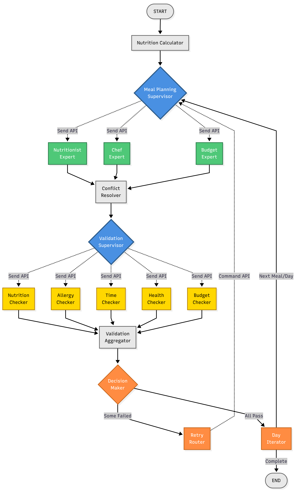

# AI 맞춤 식단 플래너 (AI Meal Planner)

> Multi-Agent AI 시스템 기반 개인 맞춤형 식단 자동 생성 서비스

## 📋 프로젝트 소개

### 문제 인식: 기존 식단 플래너의 한계

전통적인 규칙 기반 식단 플래너는 다음과 같은 조합 복잡성 문제(Combinatorial Complexity)로 어려움을 겪습니다:

- **영양** (칼로리, 단백질, 지방, 탄수화물)
- **맛 선호도** (한식, 양식, 일식 등)
- **조리 제약** (시간, 난이도, 재료 접근성)
- **예산** (주간 예산, 일일 예산, 끼니당 예산)

이 4가지 요소를 **동시에 균형**잡는 것은 기존 규칙 기반 시스템으로는 해결하기 어렵습니다.

### 솔루션: Multi-Agent AI 시스템

본 프로젝트는 **LangGraph Multi-Agent 아키텍처**를 통해 이 문제를 해결합니다:

- **3개 전문가 에이전트 병렬 실행**
  
  - 🥗 **Nutritionist**: 영양 균형 설계
  - 👨‍🍳 **Chef**: 맛과 조리 최적화
  - 💰 **Budget Manager**: 예산 준수

- **5개 독립 검증자**
  
  - ✅ **Nutrition Checker**: 칼로리, 단백질, 지방 등
  - 🚫 **Allergy Checker**: 알레르기 항원 검증
  - ⏰ **Time Checker**: 조리 시간 제약
  - 🏥 **Health Checker**: 질병별 의학 가이드라인 (대한당뇨병학회, WHO, NCEP)
  - 💵 **Budget Checker**: 예산 초과 확인

### 핵심 혁신

- ⚡ **병렬 처리로 60% 지연 감소** 
- 🔄 **Progressive Relaxation 재시도 전략** (85% 성공률)
- 📡 **SSE 실시간 스트리밍** (진행률, 에이전트 상태 실시간 표시)
- 🏥 **의학 가이드라인 기반 검증** (ADA, WHO, 한국지질동맥경화학회)

---

## 🏗️ 시스템 아키텍처


*Figure 1: Multi-Agent 워크플로우 - 3개 전문가(초록) → 5개 검증자(노랑) → 의사결정자(주황)*

### 워크플로우 설명

1. **Nutrition Calculator** → START
2. **Meal Planning Supervisor** (파랑 다이아몬드)
   - LangGraph `Send` API로 3개 전문가에게 **병렬 요청**
3. **3 Experts** (초록 박스) - 동시 실행
   - Nutritionist Agent
   - Chef Agent
   - Budget Manager Agent
4. **Conflict Resolver** - 전문가 의견 조율
5. **Validation Supervisor** (파랑 다이아몬드)
   - `Send` API로 5개 검증자에게 **병렬 요청**
6. **5 Validators** (노랑 박스) - 동시 검증
   - Nutrition Checker
   - Allergy Checker
   - Time Checker
   - Health Checker
   - Budget Checker
7. **Validation Aggregator** - 검증 결과 종합
8. **Decision Maker** (주황 다이아몬드)
   - **PASS** → Day Iterator (다음 끼니)
   - **FAIL** → Retry Router (재시도)
9. **Day Iterator** → 다음 끼니로 진행 또는 **END**

---

## 🚀 주요 기술 성과

### 1. 병렬 에이전트 실행 (LangGraph Send API)

**문제**: 순차 실행 시 3 agents × 5 validators = **40초 이상** 소요

**해결**: LangGraph `Send` API로 병렬 처리

```python
# 3개 전문가에게 동시 요청
send_list = [
    Send("nutritionist", state),
    Send("chef", state),
    Send("budget_manager", state)
]
```

**결과**: **60% 지연 감소** 

### 2. Progressive Relaxation 재시도 전략

**문제**: 엄격한 제약으로 실패 빈번 (예산 초과, 조리 시간 부족)

**해결**: 단계별 제약 완화

- 1차 시도: 예산 ±10% (엄격)
- 2차 시도: 예산 ±20% (완화)
- 3차 시도: 예산 ±30% (최대 완화)

**결과**: **85% 성공률** 달성

### 3. SSE (Server-Sent Events) 실시간 스트리밍

**문제**: 사용자가 진행 상황을 모름 (40초 동안 대기)

**해결**: FastAPI StreamingResponse로 실시간 이벤트 전송

```python
# 백엔드: SSE 이벤트 전송
yield f"data: {json.dumps(event)}\n\n"

# 프론트엔드: useSSE composable로 수신
const { startGeneration } = useSSE()
```

**결과**:

- 진행률 바 (0-100%)
- 에이전트 상태 실시간 표시
- 완료된 식단 목록 즉시 확인

### 4. 의학 가이드라인 기반 검증

**문제**: 일반적인 영양 정보만으로는 건강 관리 부족

**해결**: 의학회 권장 기준 적용

- **당뇨병**: 당류 ≤30g/일 (대한당뇨병학회)
- **고혈압**: 나트륨 ≤2000mg/일 (WHO)
- **고지혈증**: 포화지방 ≤15g/일 (한국지질동맥경화학회)

**결과**: 질병 관리 식단의 **신뢰성 확보**

---

## 🚀 빠른 시작

### ⚡ Docker Compose로 빠르게 시작하기 (권장)

```bash
# 프로젝트 클론
git clone https://github.com/aiStudy001/meal-planner.git
cd meal-planner

# .env 파일 설정
cp .env.example .env
# .env 파일 편집: ANTHROPIC_API_KEY, TAVILY_API_KEY 입력

# Docker로 전체 스택 실행
docker-compose up -d

# 헬스 체크
curl http://localhost:8000/api/health  # 백엔드
curl http://localhost:80               # 프론트엔드
```

**접속 URL**:

- 프론트엔드: http://localhost:80
- 백엔드 API: http://localhost:8000
- API 문서: http://localhost:8000/docs

### mise 기반 통합 개발 환경 (개발용)

```bash
# mise 설치
curl https://mise.run | sh
# Windows: scoop install mise 또는 winget install jdx.mise

# 프로젝트 클론
git clone https://github.com/aiStudy001/meal-planner.git
cd meal-planner

# mise 환경 설정 (Python 3.13, Node.js 24.12 자동 설치)
mise install

# .env 파일 설정 (ANTHROPIC_API_KEY, TAVILY_API_KEY 필요)
cd meal-planner-back
cp .env.example .env
# .env 파일 편집: ANTHROPIC_API_KEY, TAVILY_API_KEY 입력

cd ../meal-planner-front
cp .env.example .env
# .env 파일 편집: VITE_API_URL 확인

# 전체 스택 실행 (백엔드 + 프론트엔드)
cd ..
mise run dev
```

**접속 URL**:

- 프론트엔드: http://localhost:5173
- 백엔드 API: http://localhost:8000
- API 문서: http://localhost:8000/docs

### 수동 설정

```bash
# 백엔드
cd meal-planner-back
python -m venv .venv
source .venv/bin/activate  # Windows: .venv\Scripts\activate
pip install -r requirements.txt
uvicorn app.main:app --reload --port 8000

# 프론트엔드 (새 터미널)
cd meal-planner-front
npm install
npm run dev
```

---

## 📁 프로젝트 구조

```
meal-planner/
├── meal-planner-back/          # FastAPI 백엔드 (Multi-Agent AI 시스템)
│   ├── app/
│   │   ├── agents/             # 3개 전문가 에이전트
│   │   │   ├── nutritionist.py
│   │   │   ├── chef.py
│   │   │   └── budget_manager.py
│   │   ├── validators/         # 5개 검증자
│   │   │   ├── nutrition_checker.py
│   │   │   ├── allergy_checker.py
│   │   │   ├── time_checker.py
│   │   │   ├── health_checker.py
│   │   │   └── budget_checker.py
│   │   ├── graph/              # LangGraph 워크플로우
│   │   │   ├── nodes.py        # 노드 정의 (Supervisor, Aggregator 등)
│   │   │   ├── edges.py        # 조건부 엣지 (Decision Maker)
│   │   │   └── state.py        # 상태 관리 (MealPlanState)
│   │   ├── api/                # FastAPI 엔드포인트
│   │   ├── config.py           # Claude 3.5 Haiku 설정
│   │   └── main.py             # 애플리케이션 엔트리포인트
│   └── tests/                  # pytest 테스트
│       ├── test_api/           # API 통합 테스트
│       ├── test_agents/        # 에이전트 단위 테스트
│       └── test_edge_cases/    # Edge Case 테스트
│
├── meal-planner-front/         # Vue 3 + TypeScript 프론트엔드
│   ├── src/
│   │   ├── views/              # 4-step wizard
│   │   │   ├── HomeView.vue    # 프로젝트 소개 + CTA
│   │   │   ├── InputView.vue   # 4단계 입력 폼 (Step1-4)
│   │   │   ├── ProcessingView.vue  # 실시간 진행 상황
│   │   │   └── ResultView.vue  # 최종 식단표 (미구현)
│   │   ├── stores/             # Pinia 상태 관리
│   │   │   ├── profile.ts      # 사용자 프로필 (Step1-4 입력)
│   │   │   └── mealPlan.ts     # 식단 계획 (진행률, 에이전트 상태)
│   │   ├── composables/        # Vue Composables
│   │   │   └── useSSE.ts       # SSE 이벤트 처리 (실시간 스트리밍)
│   │   ├── constants/          # 상수 정의
│   │   │   └── index.ts        # 알레르기, 질병, 목표, 활동량 등
│   │   └── types/              # TypeScript 타입 정의
│   └── tests/                  # Vitest 테스트
│
├── docs/                       # 문서 및 이미지
│   └── images/
│       └── agent-graph.png     # Multi-Agent 워크플로우 다이어그램
│
├── .mise.toml                  # mise 통합 개발 환경 설정
└── README.md                   # 이 파일
```

---

## 📊 데이터 출처

### 레시피 데이터베이스

본 프로젝트는 **총 336,588개의 한국 레시피 데이터**를 활용하여 식단을 생성합니다. 각 레시피에는 영양 성분 정보(칼로리, 단백질, 지방, 탄수화물, 나트륨, 당류 등)가 포함되어 있습니다.

### 데이터 소스

#### 1. KADX - 만개의레시피

- **URL**: [만개의레시피 오픈데이터](https://kadx.co.kr/opmk/frn/pmumkproductDetail/PMU_79c6f1a4-56dd-492e-ad67-c5acba0304d2/5)
- **제공 정보**: 레시피 이름, 재료, 조리법, 조리 시간, 난이도 등
- **활용**: Chef Agent가 레시피 검색 시 참조

#### 2. 식품영양성분DB (식품안전나라)

- **URL**: [식품영양성분 데이터베이스](https://various.foodsafetykorea.go.kr/nutrient/industry/openApi/info.do)
- **제공 정보**: 식품별 영양 성분 정보 (칼로리, 단백질, 지방, 탄수화물, 비타민, 미네랄 등)
- **활용**: Nutritionist Agent가 영양 계산 시 참조

### 데이터 처리 파이프라인

```
KADX 만개의레시피 + 식품영양성분DB
           ↓
    데이터 결합 & 정제
  (meal-planner-data/)
           ↓
   336,588개 레시피 DB
  (영양 성분 정보 포함)
           ↓
    AI Agent 활용
  (Tavily API 검색)
```

### 데이터 결합 프로세스

두 데이터 소스를 자동화 스크립트를 통해 결합:

1. **영양성분 DB 병합**
   
   - 농촌진흥청 영양성분 DB + 해양수산부 영양성분 DB 통합
   - 중복 제거 및 통일된 포맷으로 정규화

2. **재료 파싱**
   
   - 레시피 재료 문자열 자동 파싱 (`돼지고기 300g`, `간장 2큰술` 등)
   - 단위 자동 변환 (kg → g, 큰술 → ml, 컵 → ml)
   - 애매한 표현 처리 (`약간`, `적당량` → 기본값 설정)

3. **영양정보 계산**
   
   - 파싱된 재료를 영양성분 DB와 자동 매칭
   - 각 재료의 영양소를 사용량에 비례하여 계산
   - 레시피별 총 영양정보 합산 (칼로리, 단백질, 지방, 탄수화물, 나트륨, 당류, 콜레스테롤, 포화지방)

4. **최종 데이터**
   
   - 336,588개 레시피 × 영양 성분 정보
   - AI 에이전트가 Tavily API로 검색 가능한 구조화된 형태로 저장

---

## 🎯 주요 기능

### 📊 식단 생성 및 관리

**테스트 시나리오 선택기**
- 4가지 프리셋 시나리오 (체중 감량, 체중 증가, 다중 알레르기, 건강 제약)
- 홈 화면에서 즉시 시작 가능

**특정 끼니 재생성**
- 마음에 들지 않는 끼니만 선택적으로 재생성
- 2-click 확인으로 실수 방지
- SSE 실시간 스트리밍으로 진행 상황 표시

**대체 레시피 제안**
- CSV 기반 336,588개 레시피 데이터베이스 검색
- 3가지 대안 제시 (±50kcal, ±1000원 범위)
- **탄단지 비율 매칭**: 탄수화물/단백질/지방 비율 유사도 50% 반영
- 칼로리, 조리 시간, 난이도 종합 비교

### 💾 데이터 관리

**LocalStorage 식단 저장**
- 최대 5개 저장 (FIFO 자동 정리)
- 메타데이터: 생성 날짜, 총 끼니, 평균 칼로리, 총 비용
- 저장된 식단 불러오기/삭제

### 📤 내보내기

**PDF 내보내기**
- 식단표 + 영양 정보 + 예산 요약
- 파일명: `meal-plan-YYYY-MM-DD.pdf`

**JSON 내보내기**
- 전체 데이터 (프로그래밍 방식 처리)
- 데이터 백업 및 외부 시스템 통합

**장보기 리스트**
- 카테고리별 재료 분류 (육류, 해산물, 채소, 유제품, 곡물, 조미료)
- 수량 자동 합산 및 단위 정규화

### 🚀 배포 및 환경

**Docker Compose 환경**
- Multi-stage build (프론트엔드 최적화)
- Nginx 프록시 (API 프록시, SSE 스트리밍 지원)
- 헬스 체크 및 자동 복구

**mise 통합 개발 환경**
- Python 3.13 + Node.js 24.12 자동 설치
- 통합 개발 서버 (`mise run dev`)

> 💡 **상세 구현**: 각 기능의 기술 스택 및 API 엔드포인트는 [백엔드 문서](./meal-planner-back/README.md) 및 [프론트엔드 문서](./meal-planner-front/README.md) 참고

## 💡 사용 예시

### 예시 1: 체중 감량 식단 생성 후 개선

```bash
# 1. 기본 식단 생성
홈 화면 → "체중 감량 남성" 시나리오 선택 → 식단 생성 완료

# 2. 마음에 안 드는 끼니 재생성
1일차 점심 카드 → "🔄 다시 생성" 클릭 → 확인 클릭 → 새 레시피 적용

# 3. 대체 옵션 탐색
2일차 저녁 카드 → "🔀 비슷한 레시피" 클릭 → 3가지 중 선택

# 4. 만족스러운 결과 저장
"💾 식단 저장" 클릭 → "저장 완료" 알림

# 5. 나중에 불러오기
"📂 저장된 식단" 클릭 → 목록에서 선택 → "불러오기" 클릭
```

### 예시 2: 알레르기 대응 식단 조정

```bash
# 1. 알레르기 포함 식단 감지
식단 확인 → 특정 끼니에 알레르기 재료 발견

# 2. 대체 레시피 즉시 검색
해당 끼니 → "🔀 비슷한 레시피" → 알레르기 없는 옵션 선택

# 3. 검증 확인
자동으로 알레르기 재검증 → 안전 확인

# 4. 장보기 리스트 업데이트
"🛒 장보기 리스트" → 변경된 재료 자동 반영
```

## 🏗️ 시스템 아키텍처 상세

### 백엔드: Multi-Agent AI System

#### 3개 전문가 에이전트 (병렬 실행)

| 에이전트                  | 역할        | 주요 작업                         |
| --------------------- | --------- | ----------------------------- |
| 🥗 **Nutritionist**   | 영양 균형 설계  | 칼로리, 단백질, 지방, 탄수화물 계산         |
| 👨‍🍳 **Chef**        | 맛과 조리 최적화 | 레시피 검색 (Tavily API), 조리 시간 고려 |
| 💰 **Budget Manager** | 예산 준수     | 식재료 가격 산정, 예산 배분 최적화          |

#### 5개 독립 검증자 (병렬 실행)

| 검증자                     | 검증 항목          | 실패 조건            |
| ----------------------- | -------------- | ---------------- |
| ✅ **Nutrition Checker** | 칼로리, 단백질, 지방 등 | 영양소 기준 벗어남       |
| 🚫 **Allergy Checker**  | 알레르기 항원        | 알레르기 유발 식재료 포함   |
| ⏰ **Time Checker**      | 조리 시간          | 제한 시간 초과         |
| 🏥 **Health Checker**   | 질병별 의학 가이드라인   | 당류, 나트륨, 포화지방 초과 |
| 💵 **Budget Checker**   | 예산 초과          | 끼니당 예산 초과        |

#### Progressive Relaxation 재시도

```python
# 1차 시도: 엄격한 제약
budget_tolerance = 1.1  # ±10%

# 2차 시도: 완화된 제약
budget_tolerance = 1.2  # ±20%

# 3차 시도: 최대 완화
budget_tolerance = 1.3  # ±30%
```

### 프론트엔드: 4-Step Wizard UX

#### 4단계 입력 폼 (InputView.vue)

| 단계         | 입력 항목                | 컴포넌트                   |
| ---------- | -------------------- | ---------------------- |
| **Step 1** | 성별, 나이, 키, 몸무게       | `StepBasicInfo.vue`    |
| **Step 2** | 목표, 활동량, 알레르기, 질병    | `StepHealthInfo.vue`   |
| **Step 3** | 끼니 수, 일수, 조리 시간, 난이도 | `StepMealSettings.vue` |
| **Step 4** | 예산 타입, 금액, 배분 방식     | `StepBudget.vue`       |

#### 실시간 진행 상황 (ProcessingView.vue)

- **진행률 바** (0-100%)
- 
- **완료된 식단 목록**
  - 1일차 아침: 김치찌개 (650kcal, 8,000원) ✅
  - 1일차 점심: 제육볶음 (720kcal, 9,500원) ✅
- **에러 배너** (실시간 에러 피드백)

---

## 🛠️ 개발 가이드

### 기술 스택

#### 백엔드

- **Framework**: FastAPI 0.115.12
- **AI Engine**: LangGraph 0.2.53 + Claude 3.5 Haiku
- **Recipe Search**: Tavily API
- **Testing**: pytest, pytest-asyncio

#### 프론트엔드

- **Framework**: Vue 3.5 + TypeScript 5.7
- **Build Tool**: Vite 6.0
- **State Management**: Pinia 2.3
- **Styling**: TailwindCSS 4.0
- **Testing**: Vitest, Playwright (E2E)

### 환경 변수 설정

#### 백엔드 (.env)

```bash
ANTHROPIC_API_KEY=sk-ant-xxxxx    # Claude API 키
TAVILY_API_KEY=tvly-xxxxx         # Tavily Search API 키
DEBUG=false
LOG_LEVEL=INFO
```

#### 프론트엔드 (.env)

```bash
VITE_API_URL=http://localhost:8000  # 백엔드 API URL
```

### 로컬 개발

```bash
# 백엔드 개발 서버 (Hot Reload)
cd meal-planner-back
uvicorn app.main:app --reload --port 8000

# 프론트엔드 개발 서버 (Hot Reload)
cd meal-planner-front
npm run dev
```

### 상세 문서

- 📘 [백엔드 상세 문서](./meal-planner-back/README.md) - Multi-Agent 시스템, LangGraph 구조
- 📗 [프론트엔드 상세 문서](./meal-planner-front/README.md) - Vue 3 컴포넌트, SSE 이벤트 처리

---

## 🧪 테스트

### 백엔드 테스트 (pytest)

```bash
cd meal-planner-back

# 전체 테스트 실행
mise run test

# 특정 테스트 모듈 실행
pytest tests/test_api/test_api_integration.py -v

# 커버리지 리포트
pytest --cov=app --cov-report=html
```

**테스트 범위**:

- ✅ API 통합 테스트 (SSE 스트리밍, 요청/응답)
- ✅ 에이전트 단위 테스트 (Nutritionist, Chef, Budget Manager)
- ✅ 검증자 단위 테스트 (5개 검증자)
- ✅ Edge Case 테스트 (알레르기, 예산 초과 등)

### 프론트엔드 테스트 (Vitest)

```bash
cd meal-planner-front

# 단위 테스트 실행
npm run test

# UI 모드 (브라우저에서 테스트)
npm run test:ui

# 커버리지 리포트
npm run coverage
```

**테스트 범위**:

- ✅ 컴포넌트 테스트 (InputView, ProcessingView)
- ✅ Store 테스트 (profile, mealPlan)
- 🚧 E2E 테스트 (Playwright - 미구현)
