# AI 맞춤 식단 플래너 - 동작 예시

## 실제 동작 URL

- **배포 URL**: http://54.252.234.206:3000/
- **GitHub**: https://github.com/aiStudy001/meal-planner

## 1. 홈 화면

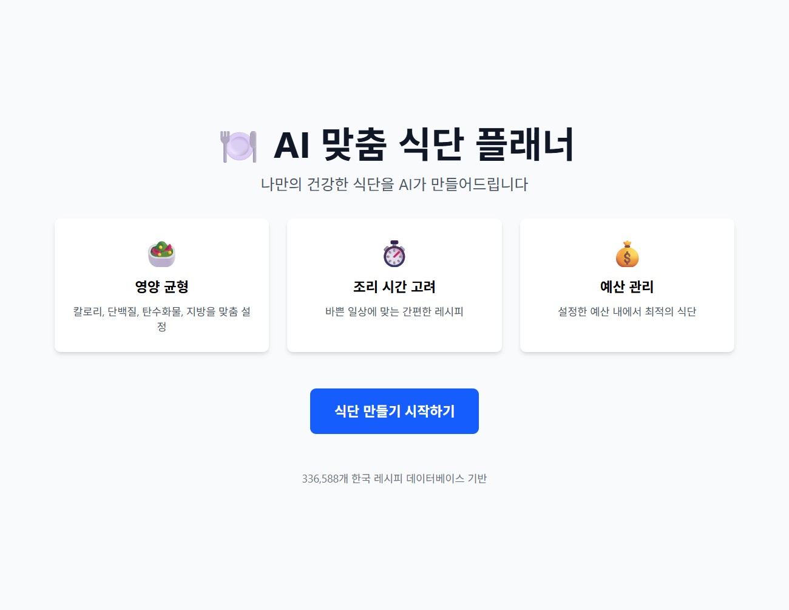
*AI 맞춤 식단 플래너의 메인 화면입니다. 영양 균형, 조리 시간 고려, 예산 관리의 3가지 핵심 기능을 제공합니다.*

## 2. 사용자 정보 입력

### Step 1: 기본 정보

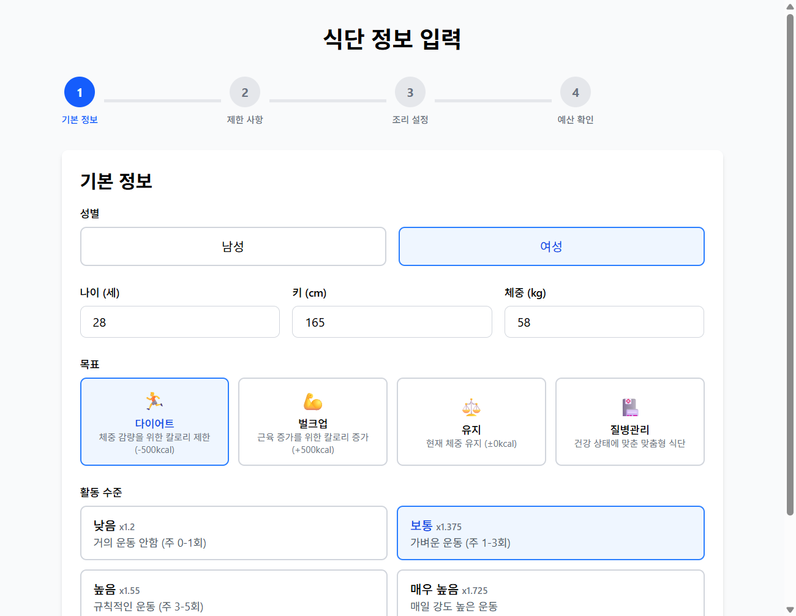
*성별, 나이, 키, 몸무게, 목표, 활동량을 입력합니다.*

### Step 2: 제한 사항

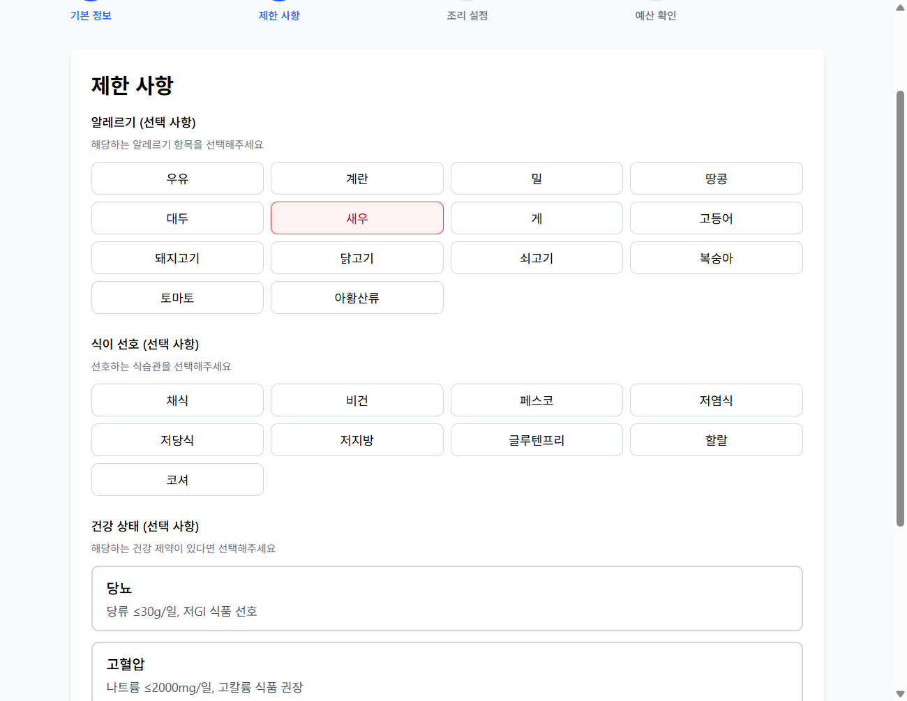
*알레르기, 식단 선호도, 건강 상태를 선택합니다.*

### Step 3: 조리 설정

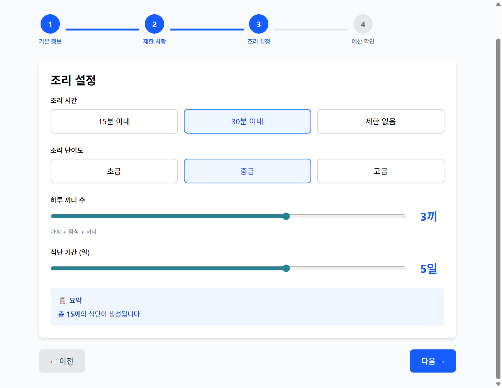
*조리 시간, 실력 수준, 하루 끼니 수, 식단 기간을 설정합니다.*

### Step 4: 예산 및 최종 확인

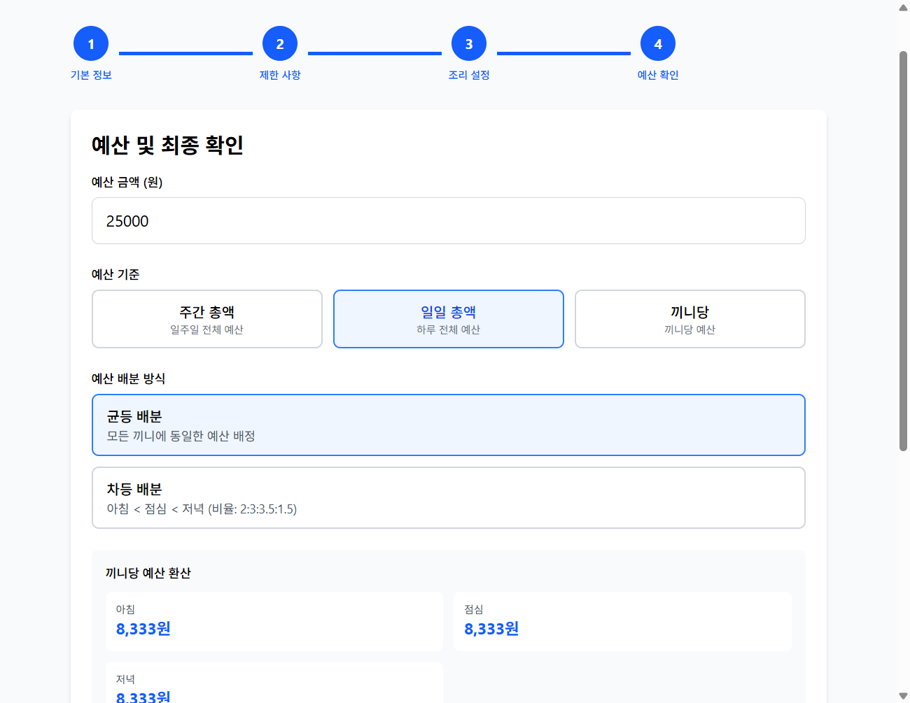
*예산을 입력하고 전체 설정을 최종 확인합니다.*

## 3. 식단 생성 과정

### 진행 중

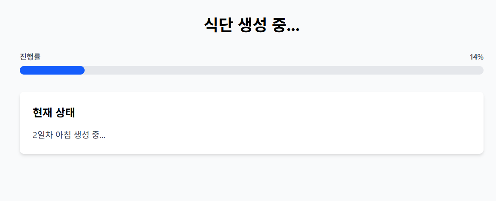
*Multi-Agent AI 시스템이 실시간으로 식단을 생성합니다. SSE를 통해 진행 상황이 실시간 업데이트됩니다.*

### 완성

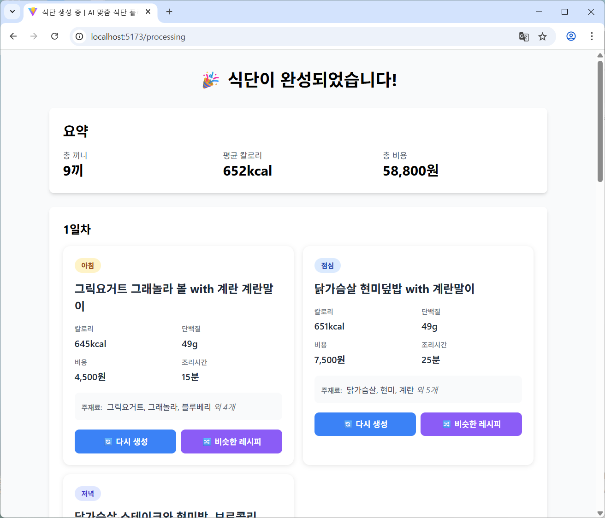
*5일치 식단이 완성되었습니다. 총 끼니 수, 평균 칼로리, 총 비용이 요약되어 표시됩니다.*

## 4. 결과 활용

### 내보내기 옵션

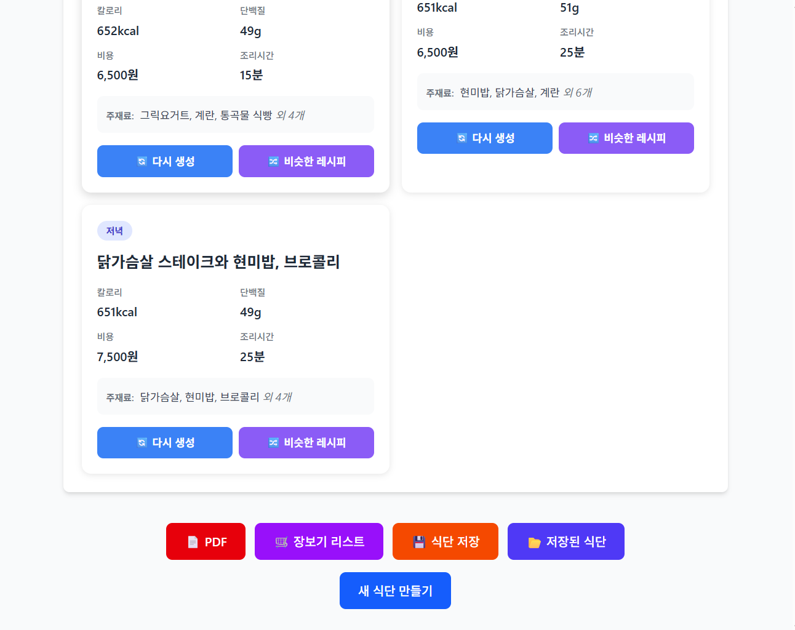
*PDF 다운로드, JSON 저장, 장보기 리스트 생성 기능을 제공합니다.*

생성된 식단은 다양한 형식으로 활용할 수 있습니다:

- **📄 PDF 다운로드**: 프린트 가능한 형식으로 식단표 저장
- **💾 JSON 저장**: 전체 데이터를 JSON 형식으로 백업
- **🛒 장보기 리스트**: 필요한 재료를 카테고리별로 정리

### 장보기 리스트

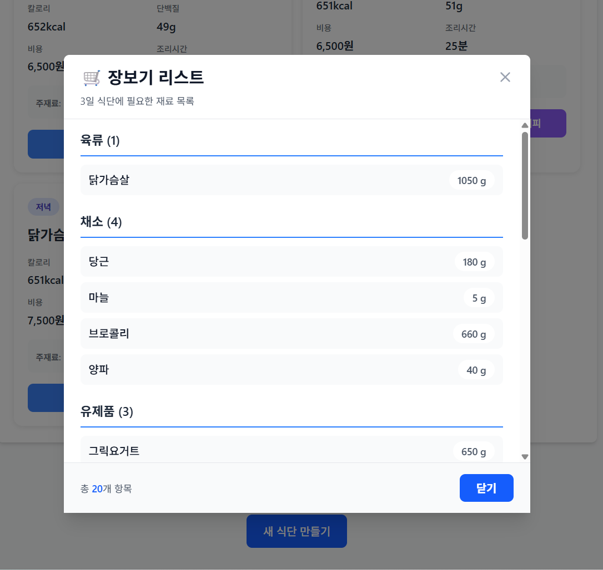
*재료를 육류, 채소, 유제품, 곡물, 조미료, 기타로 분류하여 표시합니다.*

장보기 리스트 기능은 전체 식단에 필요한 재료를 자동으로 계산하여:
- 카테고리별로 분류 (육류, 채소, 유제품, 곡물, 조미료, 기타)
- 필요 수량 자동 합산
- 중복 재료 통합 관리

## 5. 식단 개선 기능

### 특정 끼니 재생성

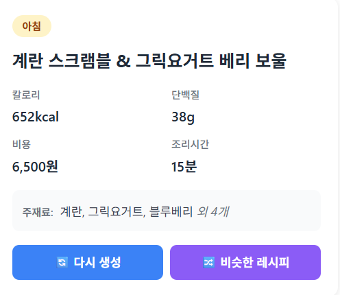
*각 끼니 카드에 "🔄 다시 생성"과 "🔀 비슷한 레시피" 버튼이 표시됩니다.*

마음에 들지 않는 끼니만 선택적으로 재생성할 수 있습니다:

1. **재생성 버튼 클릭**: 변경하려는 끼니의 "🔄 다시 생성" 버튼 클릭
2. **2-click 확인**: 실수 방지를 위한 이중 확인

*첫 클릭 후 "✅ 확인: 다시 생성" 버튼으로 변경됩니다.*

3. **실시간 진행 상황**: SSE 스트리밍으로 재생성 과정 표시

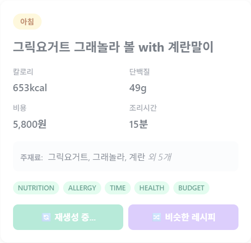
*"🔄 재생성 중..." 상태가 표시되며 AI가 새로운 레시피를 생성합니다.*

4. **자동 검증**: 영양, 알레르기, 예산, 조리시간, 건강상태 자동 재검증

재생성 기능의 특징:
- **독립적 재생성**: 해당 끼니만 변경, 나머지 식단 유지
- **안전한 확인 절차**: 2-click 확인으로 실수 방지
- **실시간 피드백**: SSE를 통한 진행 상황 실시간 표시

### 대체 레시피 제안

*같은 조건에서 다른 레시피 옵션을 탐색할 수 있습니다.*

현재 끼니와 비슷한 레시피를 추천받을 수 있습니다:

- **Tavily API 검색**: 실시간 레시피 데이터베이스 쿼리
- **조건 필터링**: 칼로리 ±50kcal, 비용 ±1000원 범위 내 검색
- **상세 비교**: 영양 성분, 비용, 조리 시간 한눈에 비교
- **즉시 적용**: 마음에 드는 레시피 클릭 한 번으로 교체

## 6. 식단 저장 및 관리

### 식단 저장

*"💾 식단 저장"과 "📂 저장된 식단" 버튼으로 식단을 관리합니다.*

생성한 식단을 브라우저에 저장하여 나중에 다시 불러올 수 있습니다:

- **LocalStorage 저장**: 서버 없이 클라이언트에서만 관리
- **최대 5개**: FIFO(First-In-First-Out) 방식으로 자동 관리
- **메타데이터 저장**: 생성 날짜, 프로필 요약, 총 비용, 평균 비용

### 저장된 식단 관리

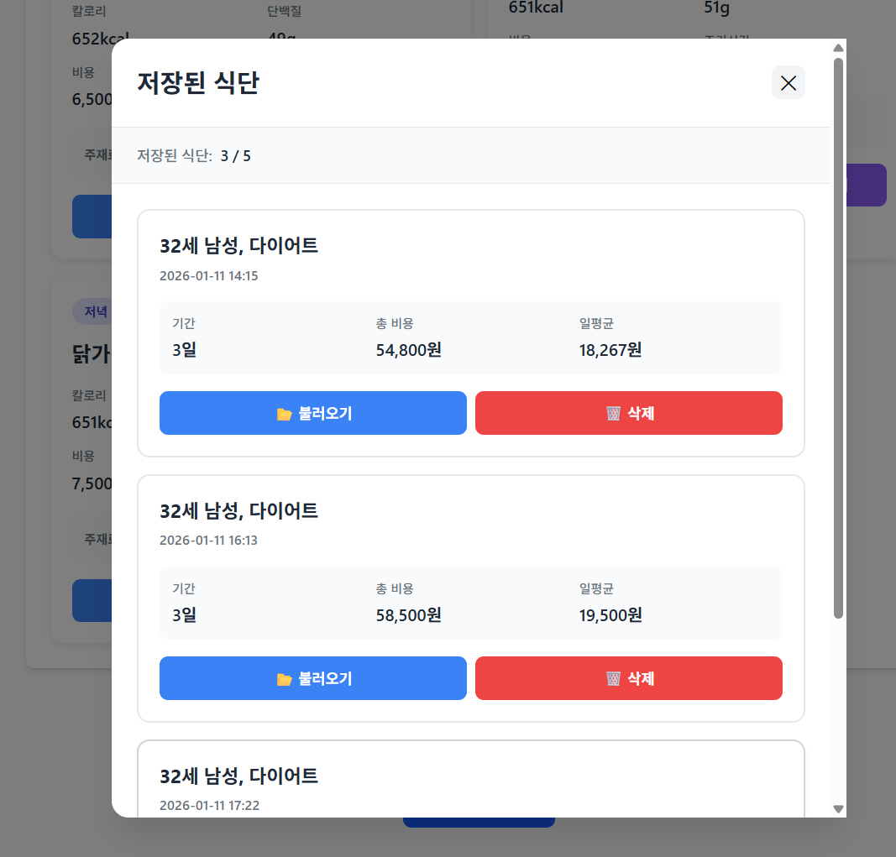
*저장된 식단 목록에서 불러오기 또는 삭제할 수 있습니다.*

저장된 식단 관리 기능:

- **목록 확인**: 날짜, 프로필 요약, 기간, 총 비용, 일평균 비용 표시
- **불러오기**: 저장된 식단을 현재 화면에 복원
- **삭제**: 불필요한 식단 개별 제거
- **자동 정리**: 5개 초과 시 가장 오래된 식단 자동 삭제
- **사용 용량 표시**: LocalStorage 사용량 실시간 확인

## 7. 사용 팁

### 효율적인 식단 생성

1. **테스트 시나리오 활용**: 처음 사용 시 미리 준비된 시나리오로 빠르게 테스트
2. **상세 입력**: 알레르기, 건강 상태, 조리 실력 정확히 입력할수록 맞춤형 결과
3. **예산 설정**: 현실적인 예산 설정으로 실행 가능한 식단 생성

### 식단 개선 워크플로우

1. **초기 생성**: 기본 정보로 전체 식단 생성
2. **개별 검토**: 각 끼니 확인 후 마음에 안 드는 항목 발견
3. **재생성 또는 대체**: "다시 생성" 또는 "비슷한 레시피"로 개선
4. **최종 저장**: 만족스러운 결과를 "식단 저장"으로 보관

### 데이터 활용

- **PDF 출력**: 냉장고에 부착하거나 주간 계획용으로 활용
- **장보기 리스트**: 마트 방문 전 필요 재료 확인
- **JSON 백업**: 다른 도구나 서비스에서 활용 가능한 데이터 보관
